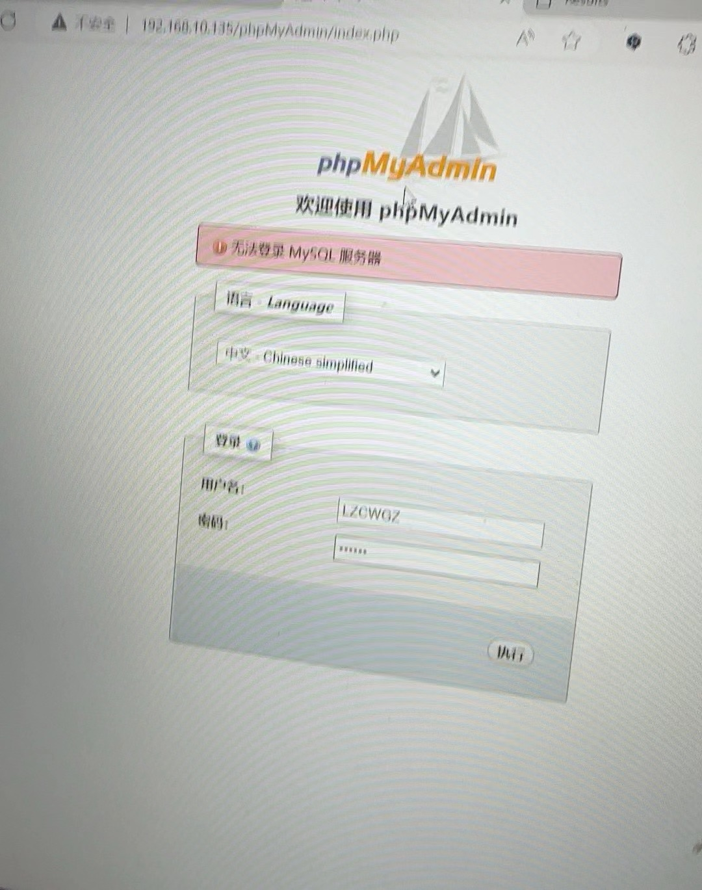
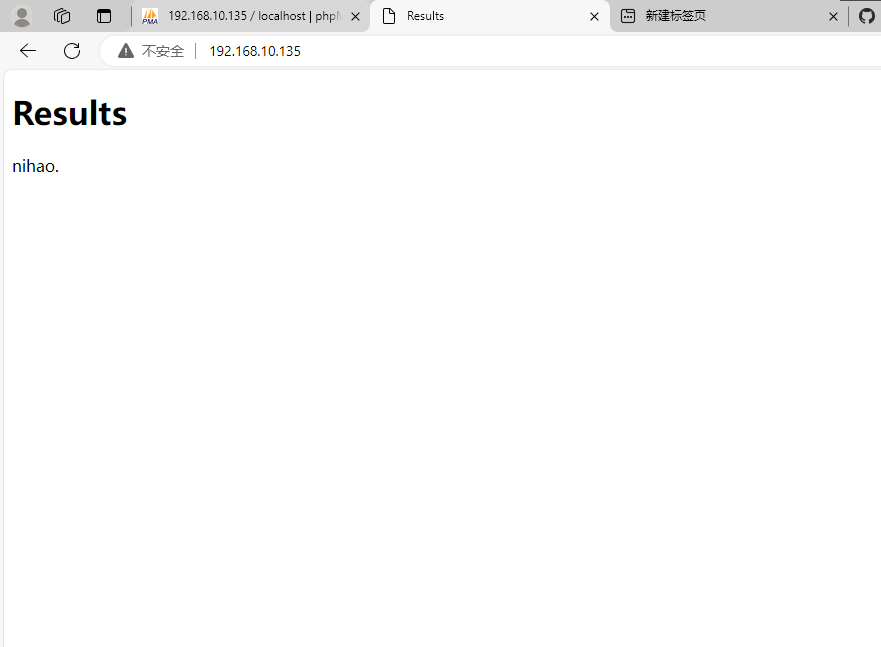
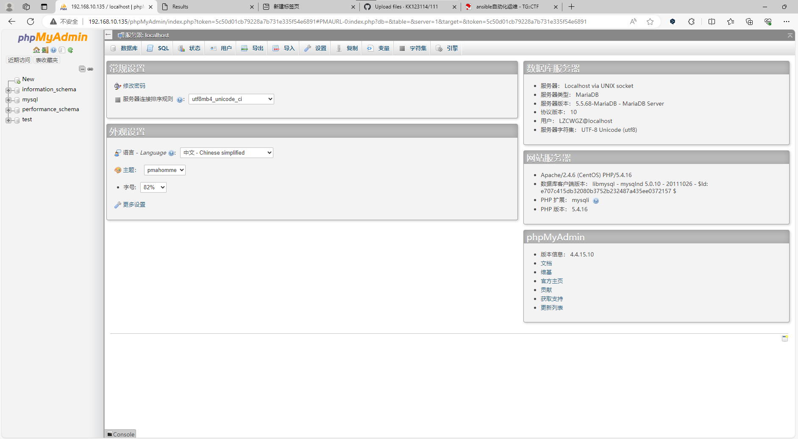

#### master主机配置

##### 在/etc/ansible/hosts上添加主机组

```
[webservers]
server1 ansible_host=192.168.10.135

[dbservers]
server2 ansible_host=192.168.10.137
```

##### 控制主机的目录

```
/etc/ansible/lamp/
├── playbook.yml
├── files/
│ ├── index.php
│ └── initial.sql
├── templates/
│ └── virtualhost.conf.j2
```

##### /etc/ansible/lamp/上创建playbook.yml

##### /etc/ansible/lamp/files/上配置index.php

##### /etc/ansible/lamp/files/上导入初始SQL “initial.sql”

##### /etc/ansible/lamp/templates/上创建virtualhost.conf.j2


#### dbserver主机配置

##### 在/root/my.cnf上添加

```
[dbservers]
user=root
password=123456
```


### 遇到的困难：

在phpMyAdmin登录界面无法登录用户



解决方法：

在webserver服务器上进到mysql数据库，

```
mysql -uroot
```

删除原有的用户“LZCWGZ”

```
drop user LZCWGZ;
```

再重新创建“LZCWGZ”并指定主机和密码，

```
create user LZCWGZ@localhost IDENTIFIED BY '123456';
```

授予用户访问数据库所有权限，

```
 GRANT ALL PRIVILEGES  ON *.* TO LZCWGZ@localhost IDENTIFIED BY '123456';
```

包括可以从任何主机访问的权限。

```
GRANT ALL PRIVILEGES  ON *.* TO LZCWGZ@'%' IDENTIFIED BY '123456';
```

#### 运行结果：


